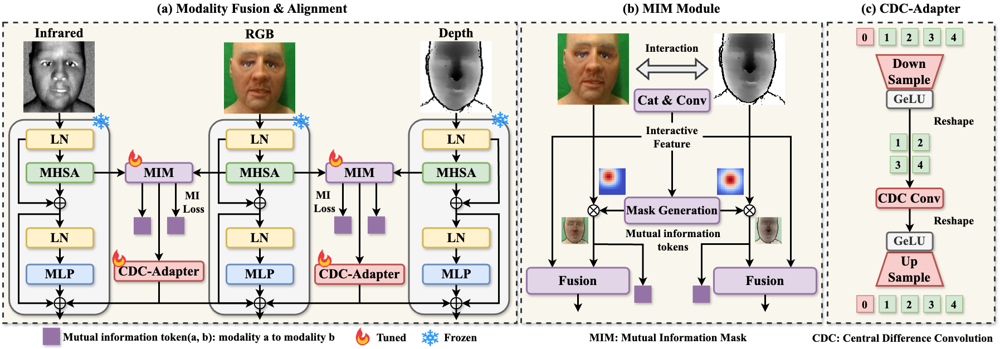








# 👴 About Me

I am currently a first-year Ph.D. student jointly trained by Fudan University and Shanghai AI Lab, supervised by [Jing Shao](https://amandajshao.github.io/). Before that, I got my Master's degree at University of Science and Technology of China (USTC) and my Bachelor's degree from Dalian Maritime University (DLMU). 

My research interest mainly includes **Computer Vision**, **Deep Learning**, **AI Agent**, **Reinforcement Learning**, **Generative Models**. [My CV](https://yjyddq.github.io/files/resume.pdf) 📄

**Email** 📧: <u>yangjingyi946@gmail.com</u> or <u>yangjingyi@mail.ustc.edu.cn</u> or <u>jingyiyang25@m.fudan.edu.cn</u>

**Wechat** 📱: wxid_fa6qu0x94mud22

😀 Please feel free to contact me for communication and collaboration.

<h1 id='news'>🔥 News</h1>

  <ul>
    <li><strong>2025.12.01</strong>: We release the codebase of DARE: dLLM Alignment and Reinforcement Executor, a framework that enables efficient fine-tuning, reinforcement learning and comprehensive evaluation of dLLMs (Project Leader).</li>  
    <li><strong>2025.09.28</strong>: We release the paper and code of Taming Masked Diffusion Language Models via Consistency Trajectory Reinforcement Learning with Fewer Decoding Step (First Author).</li>  
    <li><strong>2025.09.18</strong>: 1 paper was accepted to NeurIPS 2025 (First Author).</li>
    <li><strong>2025.06.26</strong>: 1 paper was accepted to IEEE TIFS (First Author).</li>
    <li><strong>2025.06.26</strong>: 1 paper was accepted to ICCV 2025 (First Author).</li>
    <li><strong>2025.01.22</strong>: 1 paper was accepted to ICLR 2025 (First Author).</li>
    <li><strong>2024.07.04</strong>: 1 paper was accepted to ECAI 2024 (First Author), selected as an Oral 🎉🎉🎉.</li>
  </ul>

<h1 id='research-topics'>📝 Research Topics</h1>

#### Masked Diffusion Large Language Model & Reinforcement Learning
- ``Github`` [DARE: dLLM Alignment and Reinforcement Executor](https://github.com/yjyddq/DARE). **Jingyi Yang**, Yuxian Jiang, ..., Jing Shao†

- ``ArXiv`` [Taming Masked Diffusion Language Models via Consistency Trajectory Reinforcement Learning with Fewer Decoding Step](https://arxiv.org/pdf/2509.23924). **Jingyi Yang**, Guanxu Chen, Xuhao Hu, Jing Shao†

#### Large Reasoning Model & Reinforcement Learning
- ``ArXiv`` [Conditional Advantage Estimation for Reinforcement Learning in Large Reasoning Models](https://arxiv.org/pdf/2509.23962). Guanxu Chen, Yafu Li, Yuxian Jiang, Chen Qian, Qihan Ren, **Jingyi Yang**, Yu Cheng, Dongrui Liu, Jing Shao†
<!--  
<a href="https://github.com/biuboomc/CANON">Code</a> 
  -->

#### Computer-Use Agent & Self-Evolving Agent
- ``NeurIPS 2025`` [RiOSWorld: Benchmarking the Risk of Multimodal Computer-Use Agents](https://arxiv.org/pdf/2506.00618). **Jingyi Yang*** ‡, Shuai Shao*, Dongrui Liu, Jing Shao†

- ``ArXiv`` [Your Agent May Misevolve: Emergent Risks in Self-evolving LLM Agents](https://arxiv.org/pdf/2509.26354). Shuai Shao, Qihan Ren, Chen Qian, Boyi Wei, Dadi Guo, **Jingyi Yang**, Xinhao Song, Linfeng Zhang, Weinan Zhang, Dongrui Liu, Jing Shao†
<!--  
<a href="https://github.com/ShaoShuai0605/Misevolution">Code</a> 
  -->

#### Video Understanding
- ``ICLR 2025`` [Kronecker Mask and Interpretive Prompts are Language-Action Video Learners](https://arxiv.org/pdf/2502.03549). **Jingyi Yang***, Zitong Yu*, Xiuming Ni, Jia He, Hui Li†

- ``IEEE TIFS`` [G2V2former: Graph Guided Video Vision Transformer for Face Anti-Spoofing](https://arxiv.org/abs/2408.07675). **Jingyi Yang**, Zitong Yu†, Jia He, Xiuming Ni, Liepiao Zhang, Hui Li†, Xiaochun Cao

#### Multi-Modal Learning & Domain Generalization for Face Anti-spoofing
- ``ICCV 2025`` [DADM: Dual Alignment of Domain Modality for Face Anti-Spoofing](https://arxiv.org/pdf/2503.00429). **Jingyi Yang***, Xun Lin*, Zitong Yu†, Liepiao Zhang, Xin Liu, Hui Li, Xiaochen Yuan, Xiaochun Cao

- ``ECAI 2024 Oral`` [Generalized Face Anti-spoofing via Finer Domain Partition and Disentangling Liveness-irrelevant Factors](https://arxiv.org/abs/2407.08243). **Jingyi Yang**, Zitong Yu, Xiuming Ni, Jia He, Hui Li†

<h1 id='selected-publications'>📖 Selected Publications (* Equal Contribution, ‡ Project Leader, † Corresponding Author)</h1>

ArXiv

[Taming Masked Diffusion Language Models via Consistency Trajectory Reinforcement Learning with Fewer Decoding Step](https://arxiv.org/pdf/2509.23924)

**Jingyi Yang**, Guanxu Chen, Xuhao Hu, Jing Shao†

 
<a href="https://github.com/yjyddq/EOSER-ASS-RL">**Code**</a>  / 
<a href="https://mp.weixin.qq.com/s/O1e5zmkTPu8cNnCrMPUmTQ">**机器之心**</a> 
 

---

NeurIPS 2025

[RiOSWorld: Benchmarking the Risk of Multimodal Computer-Use Agents](https://arxiv.org/pdf/2506.00618)

**Jingyi Yang*** ‡, Shuai Shao*, Dongrui Liu, Jing Shao†

 
<a href="https://yjyddq.github.io/RiOSWorld.github.io/">**Project HomePage**</a> /
<a href="https://github.com/yjyddq/RiOSWorld">**Code**</a>  / 
<a href="https://huggingface.co/datasets/JY-Young/RiOSWorld">**Dataset**</a>  <a href="https://huggingface.co/api/datasets/JY-Young/RiOSWorld?expand=downloads&expand=downloadsAllTime">**Downloads**</a> /
<a href="https://mp.weixin.qq.com/s/YCg6FZG2Csz0W1fxvG3eMg">**机器之心**</a> 

  
Demo

  <video controls width="100%">
    <source src="https://raw.githubusercontent.com/yjyddq/yjyddq.github.io/main/videos/RiOSWorld_demo.mp4" type="video/mp4">
  </video>

 

---

ICCV 2025

[DADM: Dual Alignment of Domain Modality for Face Anti-Spoofing](https://arxiv.org/pdf/2503.00429)

**Jingyi Yang***, Xun Lin*, Zitong Yu†, Liepiao Zhang, Xin Liu, Hui Li, Xiaochen Yuan, Xiaochun Cao

 
<a href="https://github.com/yjyddq/DADM">**Code**</a> 
 

---

ICLR 2025

[Kronecker Mask and Interpretive Prompts are Language-Action Video Learners](https://arxiv.org/pdf/2502.03549)

**Jingyi Yang***, Zitong Yu*, Xiuming Ni, Jia He, Hui Li†

 
<a href="https://github.com/yjyddq/CLAVER">**Code**</a>
 

---

IEEE TIFS

[G2V2former: Graph Guided Video Vision Transformer for Face Anti-Spoofing](https://arxiv.org/abs/2408.07675)

**Jingyi Yang**, Zitong Yu†, Jia He, Xiuming Ni, Liepiao Zhang, Hui Li†, Xiaochun Cao

---

ECAI 2024 Oral 🎉

[Generalized Face Anti-spoofing via Finer Domain Partition and Disentangling Liveness-irrelevant Factors](https://arxiv.org/abs/2407.08243)

**Jingyi Yang**, Zitong Yu, Xiuming Ni, Jia He, Hui Li†

 
<a href="https://github.com/yjyddq/DLIF">**Code**</a>

  
Demo

  <video controls width="100%">
    <source src="https://raw.githubusercontent.com/yjyddq/yjyddq.github.io/main/videos/fas.mp4" type="video/mp4">
  </video>

 

<h1 id='honors-and-awards'>🎖 Honors and Awards</h1>

- *2020, 2021, 2022* Excellent Student Scholarship - First Prize (2%) twice, Third Prize (10%) once
- *2022* Outstanding Graduates of Dalian City
- *2021* Competition Specific Scholarship
- *2021* The Mathematical Contest in Modeling (MCM)/Interdisciplinary Contest in Modeling (ICM) Honorable Mention
- *2019* The 11th National College Student Mathematics Competition Liaoning Province - Third Prize
- *2019* The 28th Dalian College Student Mathematics Competition - First Prize

<h1 id='academic-services'>💻 Academic Service</h1>

- Reviewer of IEEE International Joint Conference on Biometrics (IJCB) Multimodal Human Behavior Understanding & Generation 2024
- Reviewer of International Conference on Learning Representations 2025
- Reviewer of International Conference on Learning Representations 2026

    

<!-- Definations for tags -->

